# 博客内容管理方案研究 - Sindre Sorhus 案例分析

> **研究目标**: 学习顶级开发者的博客管理模式，为 PortfolioPulse 博客系统设计简洁高效的内容管理方案

## 📋 目录

- [研究对象](#研究对象)
- [技术架构](#技术架构)
- [内容管理方式](#内容管理方式)
- [文件结构](#文件结构)
- [Markdown 格式规范](#markdown-格式规范)
- [工作流程](#工作流程)
- [对 PortfolioPulse 的启示](#对-portfoliopulse-的启示)
- [实施建议](#实施建议)

---

## 🎯 研究对象

**项目**: [sindresorhus.com](https://sindresorhus.com)  
**开源仓库**: [sindresorhus/sindresorhus.github.com](https://github.com/sindresorhus/sindresorhus.github.com)  
**开发者**: Sindre Sorhus (GitHub 75.5k+ followers, 408k+ stars awesome list 创始人)  
**博客地址**: https://sindresorhus.com/blog

---

## 🏗️ 技术架构

### 核心技术栈

```yaml
框架: Astro (静态站点生成器)
语言: TypeScript + JavaScript
样式: Tailwind CSS 4
构建: Astro 构建系统
部署: GitHub Pages (sindresorhus.github.com)
分析: GoatCounter (隐私友好的统计工具)
```

### 为什么选择 Astro？

1. **性能优先**: 生成纯静态 HTML，零 JavaScript 运行时（除非需要）
2. **Markdown 原生支持**: 内置 Content Collections API
3. **构建速度快**: 比传统 SSG 快 10 倍以上
4. **灵活性高**: 支持多种前端框架（React/Vue/Svelte 等）
5. **SEO 友好**: 静态生成，爬虫可完全访问

### 技术证据

从页面源码中提取的关键信息：

```html
<!-- 构建时间戳 -->
<meta name="x-build-time" content="Tue, 21 Oct 2025 00:12:12 GMT">

<!-- Astro 生成的 CSS -->
<link rel="stylesheet" href="/_astro/_page_.BdzcXn-Q.css">

<!-- 静态生成的 sitemap -->
<link rel="sitemap" href="/sitemap-index.xml">

<!-- RSS feeds -->
<link rel="alternate" type="application/rss+xml" 
      title="Sindre Sorhus — Blog" href="/rss.xml">
```

---

## 📂 文件结构

### 完整目录树

```
sindresorhus.github.com/
├── source/
│   ├── content/              # 📝 内容管理核心目录
│   │   ├── blog/             # 博客文章 Markdown 文件
│   │   │   ├── empathy-in-open-source.md
│   │   │   ├── goodbye-nodejs-buffer.md
│   │   │   ├── issue-bumping.md
│   │   │   ├── micro-benchmark-fallacy.md
│   │   │   ├── small-focused-modules.md
│   │   │   └── supercharge-setapp.md
│   │   ├── apps/             # 应用展示内容
│   │   └── config.ts         # Content Collections 配置
│   ├── components/           # Astro 组件
│   ├── layouts/              # 页面布局
│   ├── pages/                # 路由页面
│   │   └── blog/             # 博客相关页面
│   │       ├── index.astro   # 博客列表页
│   │       └── [slug].astro  # 博客详情页（动态路由）
│   └── utils/                # 工具函数
├── public/                   # 静态资源
├── styles/                   # 全局样式
├── astro.config.js           # Astro 配置
├── package.json
└── tsconfig.json
```

### 关键文件说明

**`source/content/blog/*.md`**: 所有博客文章的 Markdown 源文件  
**`source/content/config.ts`**: 定义 Content Collections schema  
**`source/pages/blog/[slug].astro`**: 动态路由，自动为每篇文章生成页面

---

## ✍️ 内容管理方式

### 核心理念：**Git as CMS**

> "博客文章就是 Markdown 文件，提交到 Git 仓库即完成发布"

### 工作流程

```mermaid
graph LR
    A[写 Markdown] --> B[添加 Frontmatter]
    B --> C[git commit]
    C --> D[git push]
    D --> E[GitHub Actions 自动构建]
    E --> F[部署到 GitHub Pages]
```



### 优势分析

✅ **无需数据库**: 所有内容版本化在 Git 中  
✅ **无需后台管理**: 直接用编辑器编写 Markdown  
✅ **完整历史记录**: Git 提供天然的版本控制  
✅ **简单备份**: Git 仓库就是完整备份  
✅ **协作友好**: 支持 Pull Request 审核  
✅ **离线编辑**: 本地编写,批量提交

---

## 📝 Markdown 格式规范

### Frontmatter 结构

每篇博客文章以 YAML Frontmatter 开头：

```markdown
---
title: The Micro-Benchmark Fallacy
description: It's a trap.
pubDate: 2024-08-13
tags:
  - programming
---

文章正文内容...
```

### 完整字段说明

| 字段 | 类型 | 必填 | 说明 |
|------|------|------|------|
| `title` | string | ✅ | 文章标题 |
| `description` | string | ✅ | 简短描述（用于 SEO） |
| `pubDate` | date | ✅ | 发布日期（YYYY-MM-DD） |
| `tags` | array | ❌ | 标签列表 |
| `isUnlisted` | boolean | ❌ | 是否隐藏（不在列表显示） |
| `redirectUrl` | string | ❌ | 重定向 URL |

### 真实案例 1：标准技术博客

```markdown
---
title: The Micro-Benchmark Fallacy
description: It's a trap.
pubDate: 2024-08-13
tags:
  - programming
---

Micro-benchmarks, while seemingly insightful, often mislead developers 
by presenting a skewed view of performance...

## Lack of Real-World Context

Micro-benchmarks strip away the complexities of actual apps...

## The Bottom Line

While micro-benchmarks can provide some insights, they shouldn't be 
the primary basis for performance optimization decisions...
```

### 真实案例 2：产品宣传重定向

```markdown
---
#isUnlisted: true
title: Supercharge + Setapp = ❤️
description: My Supercharge app is now available on Setapp.
pubDate: 2025-01-13
redirectUrl: https://sindresorhus.com/supercharge
---
```

> **设计意图**: 这类文章主要用于 SEO 和社交媒体分享，但访问时会自动跳转到产品页面

---

## 🔄 工作流程详解

### 1. 创建新文章

```bash
# 1. 创建 Markdown 文件
cd source/content/blog
touch my-new-post.md

# 2. 编写文章（使用任意编辑器）
code my-new-post.md
```

### 2. 本地预览

```bash
npm run dev
# 访问 http://localhost:4321/blog
```

### 3. 发布流程

```bash
git add source/content/blog/my-new-post.md
git commit -m "Add blog post: My New Post"
git push origin main
```

### 4. 自动部署

GitHub Actions 自动触发：

```yaml
# .github/workflows/deploy.yml (推测)
name: Deploy to GitHub Pages

on:
  push:
    branches: [main]

jobs:
  build:
    runs-on: ubuntu-latest
    steps:
      - uses: actions/checkout@v3
      - uses: actions/setup-node@v3
      - run: npm ci
      - run: npm run build
      - uses: peaceiris/actions-gh-pages@v3
        with:
          github_token: ${{ secrets.GITHUB_TOKEN }}
          publish_dir: ./dist
```

### 5. 更新现有文章

```bash
# 直接编辑 Markdown 文件
vim source/content/blog/micro-benchmark-fallacy.md

# 提交更新
git commit -am "Update: Micro-Benchmark Fallacy post"
git push
```

---

## 💡 对 PortfolioPulse 的启示

### 当前问题分析

根据之前的清理报告，我们发现：

❌ **过度工程化**: 实现了完整的博客 CRUD 后台管理系统  
❌ **零内容产出**: 有管理后台，但 0 篇博客文章  
❌ **维护负担**: 需要维护认证系统、管理接口、前端表单  
❌ **部署复杂**: 需要数据库迁移、环境变量配置

### Sindre Sorhus 方案优势

✅ **极简架构**: 无后台管理，无认证系统  
✅ **专注内容**: 精力放在写作而非系统维护  
✅ **快速发布**: 提交即发布，无需登录管理后台  
✅ **版本控制**: Git 原生支持，历史可追溯  
✅ **静态生成**: 性能极佳，CDN 友好

---

## 🎯 实施建议

### 方案 A：Markdown + Vite 插件（推荐⭐）

**适用场景**: 当前 Vite + React 架构，希望最小改动

```typescript
// vite.config.ts
import { defineConfig } from 'vite'
import react from '@vitejs/plugin-react'
import mdx from '@mdx-js/rollup'

export default defineConfig({
  plugins: [
    { enforce: 'pre', ...mdx() },
    react()
  ]
})
```

**目录结构**:

```
frontend-vite/
├── src/
│   ├── content/
│   │   └── blog/
│   │       ├── 2024-08-13-micro-benchmarks.md
│   │       └── 2025-01-13-project-update.md
│   ├── pages/
│   │   └── blog/
│   │       ├── BlogList.tsx
│   │       └── BlogPost.tsx
│   └── lib/
│       └── blog-loader.ts  # 解析 Markdown + Frontmatter
```

**实现步骤**:

1. 安装依赖: `npm i gray-matter remark remark-html`
2. 创建 Markdown 解析器
3. 修改博客列表页，从 API 改为读取 Markdown
4. 删除后端博客 API 和数据库表

---

### 方案 B：保留数据库，CLI 工具添加

**适用场景**: 需要数据库功能（标签统计、搜索等）

**工具实现**:

```rust
// backend/src/bin/blog-cli.rs
use clap::Parser;
use sqlx::MySqlPool;

#[derive(Parser)]
struct Cli {
    #[arg(short, long)]
    file: String,  // Markdown 文件路径
}

#[tokio::main]
async fn main() -> Result<(), Box<dyn std::error::Error>> {
    let cli = Cli::parse();
    
    // 1. 解析 Markdown frontmatter
    let content = std::fs::read_to_string(&cli.file)?;
    let (meta, body) = parse_frontmatter(&content)?;
    
    // 2. 连接数据库
    let pool = MySqlPool::connect(&env::var("DATABASE_URL")?).await?;
    
    // 3. 插入数据库
    sqlx::query!(
        "INSERT INTO blog_posts (title, slug, content, published_at) VALUES (?, ?, ?, ?)",
        meta.title, meta.slug, body, meta.pub_date
    )
    .execute(&pool)
    .await?;
    
    println!("✅ Blog post added: {}", meta.title);
    Ok(())
}
```

**使用方式**:

```bash
# 编写 Markdown
vim content/blog/my-post.md

# 导入数据库
cargo run --bin blog-cli -- --file content/blog/my-post.md

# 提交到 Git
git add content/blog/my-post.md
git commit -m "Add blog: My Post"
```

---

### 方案 C：完全迁移到 Astro（长期）

**适用场景**: 重构整个前端，追求极致性能

**优势**:
- 原生 Markdown 支持
- 构建速度快 10 倍
- SEO 友好
- 组件化开发

**工作量**: 🔴 高（需重写所有页面）

---

## 📊 方案对比

| 维度 | 方案 A: Vite + MDX | 方案 B: 数据库 + CLI | 方案 C: 迁移 Astro | 当前方案（已删除） |
|------|-------------------|---------------------|-------------------|-----------------|
| **开发复杂度** | 🟢 低 | 🟡 中 | 🔴 高 | 🔴 高 |
| **维护成本** | 🟢 低 | 🟡 中 | 🟢 低 | 🔴 高 |
| **内容管理** | 🟢 Git 直接提交 | 🟡 CLI + Git | 🟢 Git 直接提交 | 🔴 需登录后台 |
| **性能** | 🟢 优秀 | 🟡 良好 | 🟢 极佳 | 🟡 依赖 API |
| **数据库依赖** | ❌ 不需要 | ✅ 需要 | ❌ 不需要 | ✅ 需要 |
| **搜索功能** | 🟡 需自实现 | 🟢 SQL 查询 | 🟢 插件支持 | 🟢 SQL 查询 |
| **实施时间** | 📅 1-2 天 | 📅 2-3 天 | 📅 1-2 周 | ✅ 已完成（已删除） |

---

## ✅ 最终推荐

### 推荐：方案 A（Vite + MDX）

**理由**:
1. ✅ 与当前架构完美兼容（Vite + React）
2. ✅ 学习成本低，改动最小
3. ✅ 完全遵循 Sindre Sorhus 的 Git-based 理念
4. ✅ 删除数据库表，简化部署
5. ✅ 性能优秀，SEO 友好

### 实施步骤（3 步完成）

```bash
# Step 1: 安装依赖
cd frontend-vite
npm install gray-matter remark remark-html @mdx-js/rollup

# Step 2: 创建内容目录
mkdir -p src/content/blog

# Step 3: 修改博客页面（从 API 改为读取 Markdown）
# - 实现 Markdown 解析器
# - 修改 BlogList 和 BlogPost 组件
# - 删除 backend/src/handlers.rs 中的 blog 相关函数
# - 删除数据库 blog_posts 表
```

---

## 📚 参考资源

- **Sindre Sorhus 官网**: https://sindresorhus.com
- **源码仓库**: https://github.com/sindresorhus/sindresorhus.github.com
- **Astro 官方文档**: https://astro.build
- **Astro Content Collections**: https://docs.astro.build/en/guides/content-collections/
- **gray-matter**: https://github.com/jonschlinkert/gray-matter (Frontmatter 解析)
- **remark**: https://github.com/remarkjs/remark (Markdown 处理)

---

## 🎓 关键学习要点

1. **YAGNI 原则**: Don't build what you don't need（不构建用不到的功能）
2. **Git as CMS**: 版本控制系统本身就是最好的内容管理系统
3. **Static First**: 能静态生成就不要动态渲染
4. **Developer Experience**: 开发者应该用熟悉的工具（编辑器 + Git）而非管理后台
5. **Focus on Content**: 把时间花在内容创作上，而非系统维护

---

**文档生成时间**: 2025-10-21  
**研究对象版本**: sindresorhus.github.com @ 449fb39 (17 hours ago)  
**PortfolioPulse 项目状态**: 博客管理后台已删除，等待实施新方案
