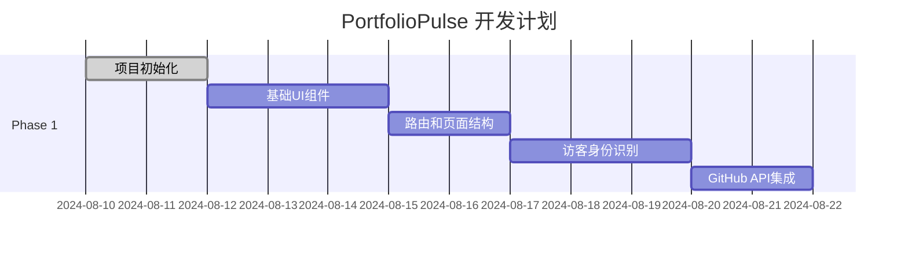

# PortfolioPulse 项目细化方向参考文档

## 📋 简化版业务逻辑总结

### ✅ 核心方案确定

#### 1. **双重认证系统**

- **专属访问链接**: 具名朋友身份，直接高信任度
- **设备指纹识别**: 匿名身份，动态信任评分
- **相同访问权限**: 两种认证方式享有相同的内容访问权限

#### 2. **三级权限体系**

```typescript
// 权限层级设计
const accessLevels = {
  guest: {
    content: 'framework_only',    // 仅显示内容框架
    interaction: 'view_only',     // 只能查看
    upgrade: 'prompted'           // 引导升级
  },

  authenticated: { // device_user 和 named_friend 同权限
    content: 'full_access',       // 完整内容访问
    interaction: 'full_interact', // 完整交互权限
    experience: 'personalized'    // 个性化体验
  }
};
```

#### 3. **反爬虫智能防护**

- **行为分析**: 检测访问模式、交互真实性
- **信任评分**: 15-100分动态评分系统
- **自动过滤**: 无需人工审核，智能内容保护

#### 4. **内容展示策略**

- **项目信息**: 访客能看列表和代码链接，认证用户看完整详情
- **学习记录**: 访客看标题概要，认证用户看完整内容和进度
- **引导升级**: 显示内容框架，引导快速认证获得完整体验

### 🎯 用户体验流程

#### **访客首次访问**:

1. 看到项目列表框架和学习记录标题
2. 尝试查看详细内容时显示升级提示
3. 可选择设备认证（一键）或输入专属链接

#### **认证用户体验**:

- **设备用户**: 显示"神秘访客 #1234" + 🎭图标
- **具名朋友**: 显示真实姓名 + 个性化头像
- **相同权限**: 都能查看完整内容、评论互动

#### **智能引导系统**:

- 首次访问自动推荐最佳认证方式
- 内容预览 + 升级提示，不强制但引导
- 支持随时在两种身份间切换

### 🛡️ 安全与开放平衡

#### **开放程度**:

- 项目信息基本开放（代码本身开源）
- 学习记录标题开放，内容需认证
- 评论互动需要认证身份

#### **安全措施**:

- 信任评分自动过滤恶意访问
- 内容框架展示避免完全封闭
- 双重认证满足不同用户需求

### 💰 成本优化实况 (基于实际服务器配置)

#### **服务器配置详情**:
```yaml
已购买配置:
  CPU: 2核心 (锐驰型)
  内存: 1GB RAM
  存储: 40GB SSD 云硬盘
  带宽: 200Mbps 峰值带宽
  地域: 广州
  系统: Ubuntu 22.04 LTS
  成本: ¥211.2/半年 (¥35.2/月)
```

#### **服务选择策略**:
- **图片存储**: 本地存储 (包含在40GB内，零额外成本)
- **邮件服务**: 暂不需要 (专注核心功能)
- **分析统计**: 自建轻量统计 (简单有效)
- **错误监控**: Sentry免费版 (5000事件/月足够)

#### **总成本结构**:
```yaml
月度成本明细:
  服务器租用: ¥35.2/月 (唯一固定成本)
  前端托管: ¥0/月 (Vercel 免费版100GB带宽)
  数据库: ¥0/月 (自建MySQL，200MB内存配置)
  图片存储: ¥0/月 (本地存储15GB预算)
  CDN加速: ¥0/月 (Cloudflare免费版)
  监控服务: ¥0/月 (Sentry免费版)
  统计分析: ¥0/月 (自建10MB/年存储)

总计: ¥35.2/月 (约$4.9/月) - 极致性价比
```

#### **资源分配优化**:
```yaml
1GB内存分配:
  Ubuntu系统: ~200MB
  Rust后端: ~300MB (Release构建优化)
  MySQL数据库: ~200MB (参数调优)
  系统缓存: ~200MB
  余量缓冲: ~100MB

40GB存储分配:
  系统文件: ~8GB
  项目代码: ~2GB (前端构建+后端二进制)
  数据库文件: ~5GB (增长预留)
  图片资源: ~15GB (WebP压缩优化)
  日志文件: ~3GB (轮转清理)
  系统缓存: ~7GB (剩余空间)
```

#### **扩展性规划**:
- **当前承载**: 500-1000 日PV，20-30并发用户
- **升级触发**: 内存使用>85%或CPU>80%时考虑
- **升级成本**: 2GB内存约+¥20/月，4核CPU约+¥30/月

### 📈 与最佳实践结合

基于个人主页最佳实践研究，PortfolioPulse采用：

#### **设计理念**:

- **极简风格**: 学习Sindre Sorhus的简洁设计
- **内容驱动**: 项目和学习记录为核心展示
- **智能推荐**: 根据访客类型个性化内容

#### **技术实现**:

- **自动同步**: GitHub数据自动更新
- **响应式设计**: 完美适配各种设备
- **SEO优化**: 结构化数据和动态标题

#### **社区管理**:

- **分层互动**: 基于信任度的评论权限
- **激励机制**: 访问行为提升信任分数
- **无缝体验**: 身份切换保持历史数据

这个简化方案既保持了专业性和安全性，又提供了友好的用户体验，符合现代个人主页的最佳实践。

## 🔍 待完善的核心问题

### 1. 功能优先级确认

#### 1.1 MVP 功能范围

- [X] **核心数据同步**: GitHub提交记录、项目状态自动更新
- [X] **基础访问控制**: 三级权限体系的最简实现
- [X] **内容管理**: 项目展示、学习记录的基础CRUD
- [X] **用户身份识别**: 设备指纹和专属链接的核心逻辑

#### 1.2 已确认功能优先级

✅ **包含在第一版 (高优先级)**:
- [X] **GitHub 贡献图表**: 基于 GitHub API 的提交活动可视化，类似 GitHub 首页的贡献热力图
- [X] **响应式设计**: 参考 sindresorhus.com 的移动端适配策略，完美支持桌面和移动设备

⏸️ **暂时搁置 (后期优化)**:
- [ ] **评论系统**: 参考行业实例，大多数个人主页不内置评论，专注展示功能
- [ ] **内容搜索**: 在博客内容完善后再加入，目前项目和学习记录数量有限

### 2. 技术实现相关

#### 2.1 前端架构选型

```typescript
// 状态管理策略 - 已确定选择 Zustand
interface AppState {
  visitor: VisitorProfile;        // 访客身份
  projects: ProjectData[];        // 项目数据
  learningRecords: LearningRecord[]; // 学习记录
  contentAccess: ContentAccess;   // 内容访问权限
  githubActivity: ContributionData[]; // GitHub 贡献数据
}

// 已确认的技术选型
const confirmedTechStack = {
  stateManagement: 'Zustand', // ✅ 轻量级，适合中小项目
  styling: 'Tailwind CSS + shadcn/ui', // ✅ 已确认
  dataFetching: 'TanStack Query', // ✅ 功能全面，缓存策略灵活
  routing: 'Next.js 15 App Router', // ✅ 已确认
  formHandling: 'React Hook Form', // ✅ 性能更好，TypeScript 支持完善
  animations: 'CSS Transitions + Framer Motion', // ✅ 轻量场景用CSS，复杂交互用Framer Motion
  contributionGraph: '@uiw/react-heat-map' // ✅ GitHub 风格的热力图组件
};
```

#### 2.2 参考 sindresorhus.com 的设计实现

基于对 sindresorhus.com 源码分析，我们将采用以下设计策略：

**架构特点**:
- **Astro 框架启发**: 虽然我们使用 Next.js，但借鉴其静态生成和组件化思路
- **简洁布局**: 顶部导航 + 主内容区 + 简洁页脚的三段式布局
- **图标系统**: 使用 `tabler-icons` 或类似的图标库保持一致性

**响应式设计**:
```css
/* 参考 Sindre 的断点策略 */
.responsive-design {
  mobile: '320px - 768px',   // 移动端优先，汉堡菜单
  tablet: '768px - 1024px',  // 平板适配
  desktop: '1024px+',        // 桌面端完整导航
}

/* 关键组件适配 */
.component-responsive {
  navigation: 'sticky顶部导航 + 移动端汉堡菜单',
  projectCards: '移动端单列堆叠 + 桌面端双列网格',
  contributionGraph: '响应式热力图，移动端紧凑显示',
  codeBlocks: '移动端水平滚动 + 桌面端完整显示'
}
```

#### 2.3 后端架构细节

- [X] **API 设计**: RESTful API，简单直接，参考 GitHub API v4 风格
- [X] **数据库架构**: MySQL 关系型数据库，支持复杂查询和事务
- [X] **缓存策略**: 内存缓存 + HTTP 缓存，GitHub 数据定时更新
- [X] **认证方式**: JWT + 设备指纹双重认证系统

#### 2.4 部署与运维 - 参考最佳实践

**基于 sindresorhus.com 的部署策略**:
- [X] **前端部署**: Vercel 自动化部署，支持预览分支和环境变量
- [X] **后端部署**: VPS + Docker 容器化，参考 Rust 生产部署最佳实践
- [X] **CI/CD**: GitHub Actions 自动化工作流，参考开源项目标准
- [X] **静态资源**: 图片优化和 CDN 加速，学习 Sindre 的资源管理策略

### 3. 成本优化相关

#### 3.1 服务器资源评估

```yaml
# 资源需求预估
估算指标:
  日均访问: 100-500 PV
  并发用户: 5-20
  数据存储: <1GB
  带宽需求: 10GB/月

成本分析:
  Vercel: 免费版够用，Pro版 $20/月
  VPS: $5-10/月 (1GB RAM, 25GB SSD)
  数据库: MySQL 自建 或 PlanetScale 免费版
  CDN: Vercel 自带 或 Cloudflare 免费版
```

#### 3.2 第三方服务选择

- [ ] **图片存储**: 本地存储 vs 云存储(如何选择？)
- [ ] **邮件服务**: 是否需要邮件通知功能？
- [ ] **分析工具**: Google Analytics vs 简单的自建统计？
- [ ] **错误监控**: Sentry 免费版 vs 自建日志？

### 4. 用户体验细节

#### 4.1 响应式设计规范 - 对标 sindresorhus.com

```css
/* 基于 Sindre 网站的响应式策略 */
.breakpoints {
  mobile: '320px - 768px',    // 移动端单列布局
  tablet: '768px - 1024px',   // 平板端适配
  desktop: '1024px+',         // 桌面端多列布局

  /* 导航适配策略 */
  navigation: {
    mobile: 'sticky顶部 + 汉堡菜单 + 侧边滑出',
    desktop: '顶部横向导航 + RSS/联系图标'
  },

  /* 内容区域适配 */
  projectCards: {
    mobile: '单列卡片 + 完整信息显示',
    desktop: '双列网格 + hover效果'
  },

  /* GitHub贡献图适配 */
  contributionGraph: {
    mobile: '紧凑热力图 + 滑动查看',
    desktop: '完整年度视图 + tooltip详情'
  }
}
```

#### 4.2 GitHub 贡献图表实现

```typescript
// GitHub 贡献活动可视化
interface ContributionData {
  date: string;           // 日期 YYYY-MM-DD
  count: number;          // 提交数量
  level: 0 | 1 | 2 | 3 | 4;  // 活跃度等级
}

// 实现方案
const contributionGraphFeatures = {
  dataSource: 'GitHub API v4 GraphQL', // 获取贡献数据
  visualization: '@uiw/react-heat-map', // React 热力图组件
  interaction: '悬停显示详情 + 点击跳转到具体提交',
  responsive: '移动端紧凑显示 + 桌面端完整年度视图',
  theme: '支持明暗主题切换'
};
```

#### 4.3 加载性能优化 - 学习 Sindre 的优化策略

- [X] **首屏加载**: 目标 3 秒内完成首屏渲染，静态生成优化
- [X] **代码分割**: 路由级懒加载 + 组件级动态导入
- [X] **图片优化**: Next.js Image 组件 + WebP 格式转换
- [X] **缓存策略**: 静态资源长期缓存 + API 响应智能缓存
- [X] **字体优化**: 系统字体回退 + Web 字体预加载

#### 4.3 无障碍访问(a11y)

- [ ] **键盘导航**: Tab键导航的完整支持
- [ ] **屏幕阅读器**: 语义化HTML和ARIA标签
- [ ] **颜色对比度**: WCAG 2.1 AA级标准符合性
- [ ] **文字缩放**: 支持200%缩放不破坏布局

## 🚀 实现路径规划

### Phase 1: 基础框架搭建 (Week 1-2)



#### 核心任务:

- [X] Next.js 15 + TypeScript 项目初始化
- [X] Tailwind CSS + shadcn/ui 配置，参考 sindresorhus.com 的设计风格
- [X] 基础页面结构和路由设置 (首页、项目、学习记录、关于)
- [X] 访客身份识别的核心逻辑 (设备指纹 + 专属链接)
- [X] Zustand 状态管理配置
- [X] GitHub API v4 集成和贡献数据获取

### Phase 2: 核心功能实现 (Week 3-4)

#### 核心任务:

- [X] GitHub 贡献图表组件实现 (@uiw/react-heat-map)
- [X] 项目展示页面和卡片组件 (响应式网格布局)
- [X] 学习记录的 CRUD 功能 (React Hook Form + TanStack Query)
- [X] 三级权限内容过滤系统
- [X] 设备指纹和信任评分算法实现

### Phase 3: 用户体验优化 (Week 5-6)

#### 核心任务:

- [X] 移动端适配完善 (参考 sindresorhus.com 的响应式策略)
- [X] 访客引导和身份切换界面 (平滑过渡动画)
- [X] 贡献图表交互优化 (悬停详情 + 主题切换)
- [X] 加载性能优化 (代码分割 + 图片优化)
- [X] 基础的反爬虫防护 (行为分析 + 频率限制)

### Phase 4: 部署与监控 (Week 7-8)

#### 核心任务:

- [X] Vercel 前端部署配置 (环境变量 + 预览分支)
- [X] VPS + Docker 后端部署 (参考 Rust 部署最佳实践)
- [X] GitHub Actions CI/CD 工作流
- [X] 基础监控和错误收集 (Vercel Analytics + 简单日志)
- [X] 性能测试和 SEO 优化

## 💭 设计决策记录

### 已确认的技术选择

✅ **前端**: Next.js 15 + TypeScript + Tailwind CSS + shadcn/ui
✅ **状态管理**: Zustand (轻量级，适合中小型项目)
✅ **数据获取**: TanStack Query (功能全面，缓存策略灵活)
✅ **表单处理**: React Hook Form (性能更好，TypeScript支持完善)
✅ **动画**: CSS Transitions + Framer Motion (轻量+复杂交互结合)
✅ **后端**: Rust + MySQL (性能和类型安全)
✅ **部署**: Vercel (前端) + VPS (后端)
✅ **认证**: 双重认证系统 (专属链接 + 设备指纹)
✅ **贡献图**: @uiw/react-heat-map (GitHub 风格热力图)

### 设计参考策略

**主要参考**: sindresorhus.com
- **布局结构**: 简洁三段式布局 (导航+主内容+页脚)
- **响应式**: 移动端汉堡菜单 + 桌面端顶部导航
- **视觉风格**: 现代简约 + 明暗主题支持
- **组件设计**: 卡片式项目展示 + 标签系统
- **性能优化**: 静态生成 + 图片优化 + 代码分割

### 待决策的关键问题

#### 1. 图片存储方案

```typescript
// 选项A: 本地存储 (推荐用于MVP)
const localImageStorage = {
  location: '/public/images/',
  advantages: ['零成本', '简单部署', '完全控制'],
  disadvantages: ['占用服务器空间', '无CDN加速'],
  suitableFor: 'MVP阶段，图片数量有限'
};

// 选项B: Vercel 自带存储
const vercelStorage = {
  integration: 'Next.js Image优化',
  cost: '免费额度内',
  features: ['自动WebP转换', '响应式图片', '懒加载'],
  recommended: true
};
```

**推荐方案**: Vercel + 本地存储，利用 Next.js Image 组件优化

#### 2. GitHub 贡献数据获取策略

```typescript
// GitHub API v4 GraphQL 查询
const contributionQuery = `
  query($username: String!) {
    user(login: $username) {
      contributionsCollection {
        contributionCalendar {
          weeks {
            contributionDays {
              contributionCount
              date
            }
          }
        }
      }
    }
  }
`;

// 数据缓存策略
const cachingStrategy = {
  updateFrequency: '每4小时更新一次', // GitHub 数据变化不频繁
  storage: 'MySQL + 内存缓存',
  fallback: '本地静态数据备份'
};
```

## 📝 下一步行动计划

### 立即开始实施的计划:

#### **Week 1 目标** (已更新):

- [X] 完成 Next.js 15 + TypeScript 项目初始化
- [X] 配置 Tailwind CSS + shadcn/ui，参考 sindresorhus.com 设计系统
- [X] 实现基础页面路由 (首页、项目、学习记录、关于)
- [X] 完成访客身份识别核心逻辑 (设备指纹生成)
- [X] 集成 GitHub API 并测试贡献数据获取

#### **Week 2 目标** (新增重点):

- [X] 实现 GitHub 贡献图表组件 (@uiw/react-heat-map)
- [X] 完成项目卡片组件 (响应式设计，移动端适配)
- [X] 搭建学习记录 CRUD 基础功能
- [X] 实现三级权限内容过滤逻辑
- [X] 完成移动端导航 (汉堡菜单 + 侧边栏)

#### **优先级调整说明**:

1. **GitHub 贡献图优先**: 这是个人主页的核心特色功能，技术实现相对简单
2. **移动端适配优先**: 现代网站必备，参考 sindresorhus.com 的响应式策略
3. **评论系统延后**: 专注于内容展示和核心交互功能
4. **部署策略明确**: Vercel + VPS 的混合部署方案，充分利用两者优势

### 技术实现重点:

#### **GitHub API 集成**:
```typescript
// 主要获取数据
- 用户基本信息和头像
- 仓库列表和统计信息
- 贡献活动数据 (过去一年)
- 最新提交记录
```

#### **响应式设计关键点**:
```css
/* 基于 sindresorhus.com 的布局策略 */
- 顶部 sticky 导航 (桌面端横向，移动端汉堡菜单)
- 主内容区域 (max-width + 居中对齐)
- 贡献图表 (桌面端完整，移动端紧凑)
- 项目卡片 (桌面端双列，移动端单列)
```

---

*本文档将随着项目进展持续更新，记录所有重要的设计决策和实现细节。*
